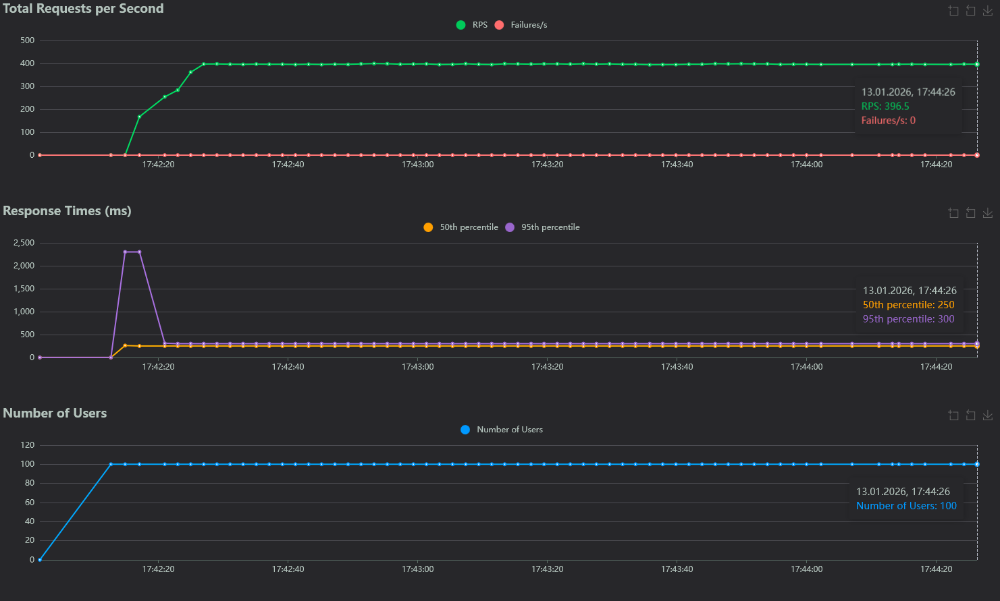
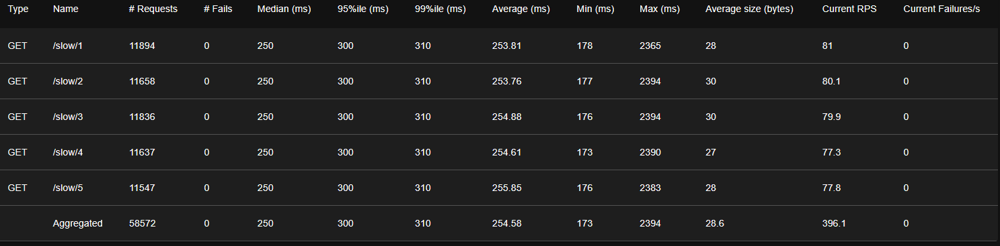
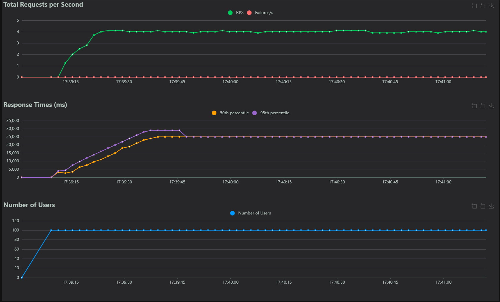
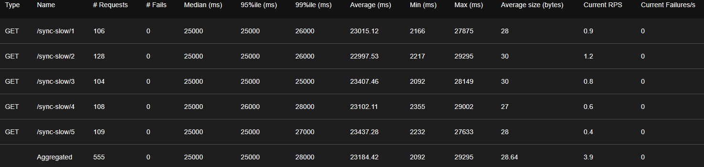
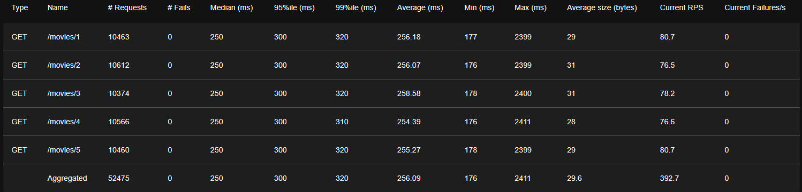
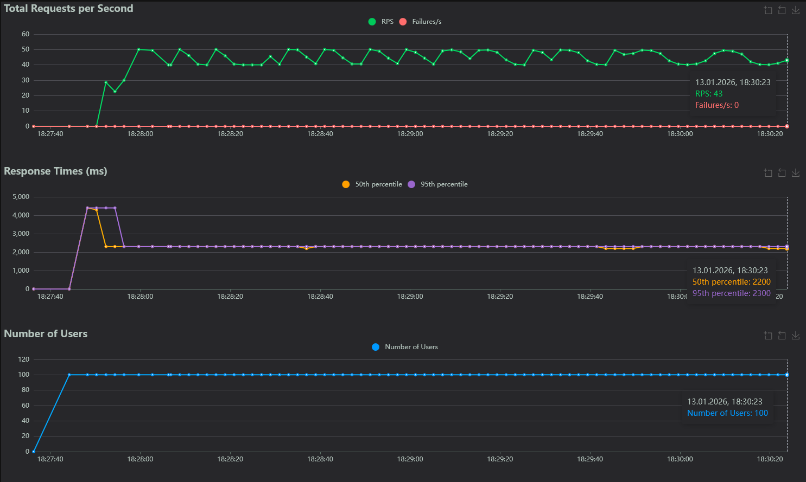
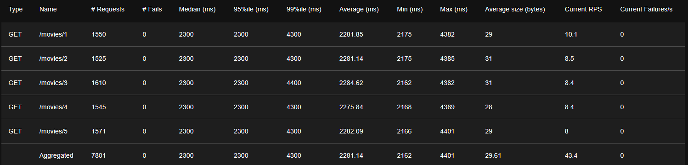

# welcome-fastapi
### A project for getting familiar with FastAPI and asynchronous programming in Python.

This project uses a Python dictionary to simulate a database, introducing a random delay of 200–300 ms for fetching a value by key.

---

# `main.py` Implemented Endpoints

### 1. Health Check
**Endpoint:** `/ping`  
**Function:** `ping()`  

- Verifies that the server is up and running.  
- Returns a simple JSON response confirming server status.  

---

### 2. Asynchronous Movie Fetch
**Endpoint:** `/movie/{id}`  
**Function:** `get_movie()`  

- Fetches a movie by its ID using a **non-blocking** call to the simulated database.  
- The `id` is passed as a **path parameter**.  
- Returns a JSON dictionary with keys `id` and `movie` (movie name).  

---

### 3. Synchronous Movie Fetch
**Endpoint:** `/sync-movie/{id}`  
**Function:** `sync_get_movie()`  

- Fetches a movie by its ID using a **blocking** call to the simulated database.  
- The `id` is passed as a **path parameter**.  
- Designed to **illustrate the difference in performance** compared to asynchronous requests.  
- Returns a JSON dictionary with keys `id` and `movie`.  

---

### 4. Asynchronous Movie Fetch with Background Logging
**Endpoint:** `/movie_with_log/{id}`  
**Function:** `get_movie_with_log()`  

- Fetches a movie by its ID using a **non-blocking** call to the simulated database.  
- The `id` is passed as a **path parameter**.  
- Uses **`BackgroundTasks`** to create logs asynchronously: the client receives the response immediately after fetching the movie, while the logging task runs in the background (`asyncio.sleep(2)` simulates a long-running task).  
- Returns a JSON dictionary with keys `id` and `movie`.

---

## `locustfile.py` Load Testing with Locust

The `locustfile.py` is used to perform **practical load testing** of our FastAPI application, comparing blocking (synchronous) and non-blocking (asynchronous) endpoints, as well as testing background tasks.

### Locust Setup

- **Library:** Locust
- **Purpose:** Measure the difference in performance between synchronous and asynchronous database calls.
- **Users:** Simulated multiple users sending requests concurrently.

### Users Defined in Locust

1. **AsyncUser**  
   Would test `/slow/{id}` endpoints (asynchronous movie fetch).  

2. **SyncUser**  
   Would test `/sync-slow/{id}` endpoints (synchronous movie fetch).  

3. **LogUser**  
   Tests `/movies/{id}` endpoint which fetches movies asynchronously with a **background logging task**.  

### Sample user template:
```python
class User(HttpUser):
    @task(1)
    def func_name(self):
        id = random.randint(1, 5)
        self.client.get(endpoint)
```

### Observations

From the screenshots captured during the tests:

### Asynchronous requests:

- Up to 400 requests per second with 100 simulated users.
- Average response time: 250–300 ms.
- Demonstrates the scalability and responsiveness of async endpoints.

### Synchronous requests:

- Only 4 requests per second under the same load.
- Average response time: around 25,000 ms (25 seconds).
- Highlights how blocking operations can bottleneck the server.

### Background Tasks (/movies/{id} with BackgroundTasks):

- Around 400 requests per second with 100 users.
- Average response time: 250–300 ms, same as pure async calls.
- Without background tasks (doing logging synchronously), requests drop to ~45 per second with ~2200 ms response time.
- Confirms that offloading long-running tasks to background allows the server to stay responsive.

### Screenshots

### Asynchronous endpoint — response time graph


### Asynchronous endpoint — statistics table


---

### Synchronous endpoint — response time graph


### Synchronous endpoint — statistics table


---

### Endpoint with BackgroundTasks — response time graph


### Endpoint with BackgroundTasks — statistics table


---

### Endpoint without BackgroundTasks (blocking logging) — response time graph


### Endpoint without BackgroundTasks (blocking logging) — statistics table


---